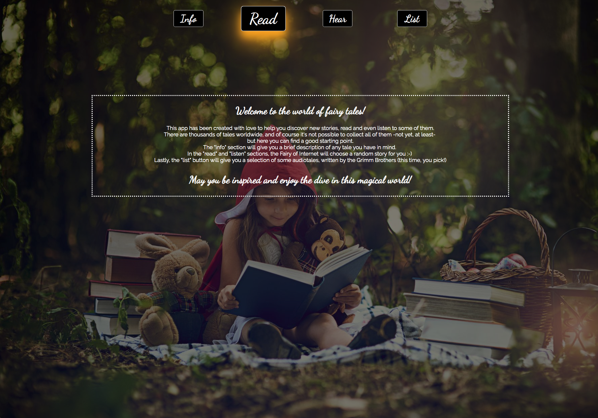
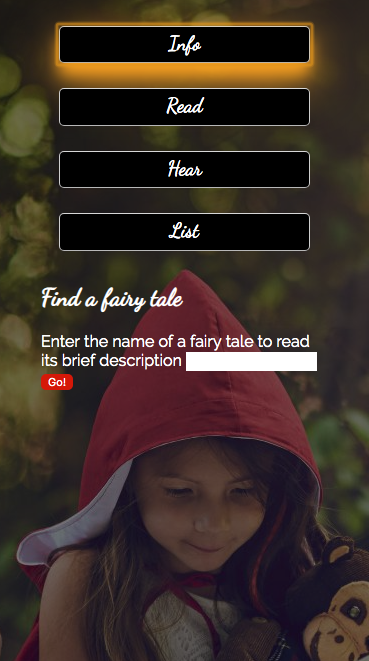
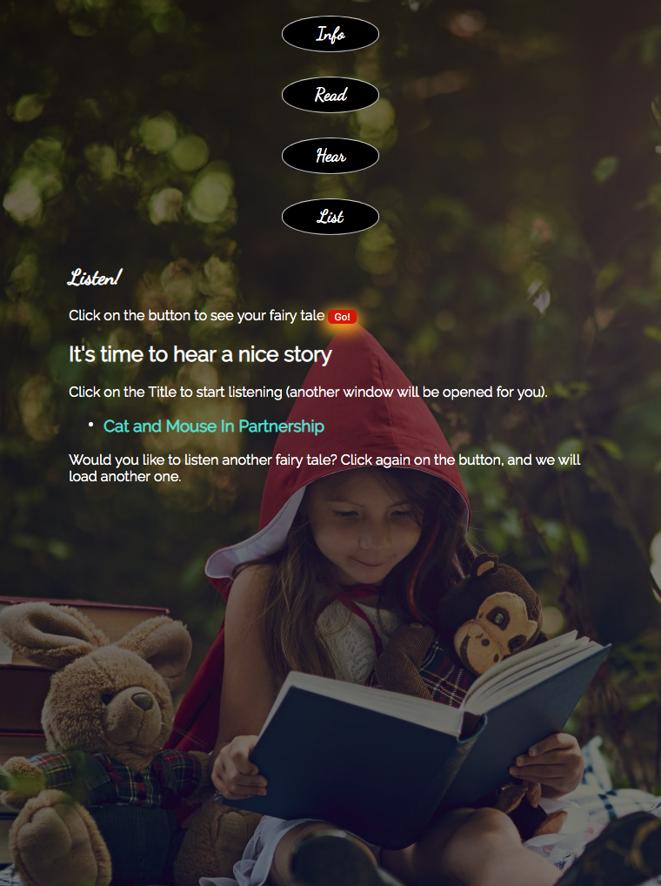

This app uses two APIs to retrieve information about fairy tales. 

One API access to Wikipedia while the other one access to LibriVox.

***

The App is composed of four buttons: 
- Info, to retrieve from Wikipedia a description of the tale
- Read, to retrieve an external link to a random tale
- Hear, to retrieve an external link to the audio of a random tale 
- List, to display the list of some Grimm Brothers' tales 

***

Built with HTML, CSS (Google Fonts for the fonts) and JQuery.

***

### Screenshots 

***

## Link to Live page
[link to Github Live](link)

